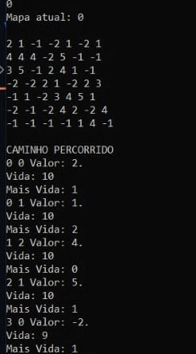
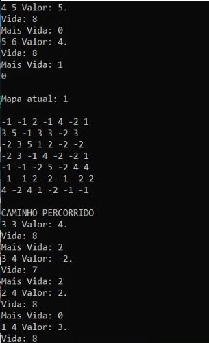
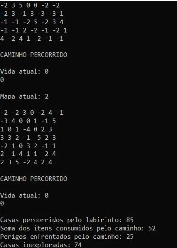

# LabirintoRecorrente: Implementação em C++

 
 
</a> 

# Problema Proposto

 Utilizando o processo de caminhamento aleatório, nesse projeto o objetivo é caminhar por matrizes NxN, passadas como entrada, iniciando pela posição digitada pelo usuário. O caminho passado será o que for gerado aleatoriamente, sendo possível caminhar a direita, a esquerda, baixo, cima, diagonais para esquerda e direita para baixo e para cima, apresentando também a possibilidade de andar entre as matrizes.   
  Através dessas regras, o objetivo do programa apresentado e consumir o máximo de itens possíveis até chegar a zerar as possibilidades ou morrer tentando. Os valores que são iguais a # são paredes, estas impossibilitam o garoto a andar naquela posição da matriz, já os que são iguais a * retiram vida do garoto, e os valores numéricos são itens, que ao serem consumidos em certa quantidade aumentam em 1 a vida do garoto. O garoto inicia o algoritmo com 10 de vida, e ao chegar em 0 o garoto perde. 

# Lógica
A função `read()` e a principal do projeto, sendo a única a ser chamada no main, ela possibilita a leitura de todas as matrizes do arquivo a serem utilizadas no restante do programa. Durante o processo de leitura que está no arquivo `ler.cpp`  na pasta `src` entre as linhas 24 a 74 ocorre o processo de tokenizacao das informações que estão no arquivo, primeiro pegando o tamanho das matrizes e depois a quantidade de matrizes no arquivo, depois ocorre a passagem de string para int juntamente com a transformação da # para -1 e * para - 2, para que seja possível fazer as operações no resto do programa. A função `criarMap()` e chamada após a finalização da leitura da primeira matriz, essa função é responsável por dividir as matriz em arquivos diferentes pegando a matriz atual que está sendo lida e colocando no arquivo criado a partir de concatenações, ela e também é responsável por alterar as matrizes ao decorrer do programa. Vale ressaltar que, durante o processo de separação das matrizes para seus respectivos arquivos, no final de cada matriz e adicionado um ponto na última linha, esse ponto e responsável por tornar possível a leitura da última linha da matriz.   

Ao finalizar este processo, a função `readOneMap()` e chamada, nela o usuário digita a posição inicial da qual irá começar a andar no primeiro mapa, enquanto o valor da posição for igual a -1, ao passar de um mapa para outro, será gerada novas posições aleatórias para [i,j] para que o garoto não caia em uma posição -1, na qual não é possível movimentar. Para andar em todas as matrizes foi criado um processo iterativo, ele é executado enquanto um contador é menor que o número de matrizes que estavam no arquivo, esta função realiza a leitura do arquivo referente ao contador atual, começando, por exemplo, na `input0.data`, durante o processo de leitura ocorre a tokenizacao das informações que estão no arquivo, e transformar de string para int, ao acabar esse processo, a função `movimento()` e chamada, esta função é responsável por movimentar o garoto pela matriz enquanto a vida atual for diferente de zero, dentro desta e valido ressaltar duas funções, a função `configDeCaminho()` que e responsável por gerar o número aleatório de 0 a 7 que irá determinar na função `selecionandoCaminho()` o caminho a ser tomado pelo garoto, evitando sempre as posições de valor -1, observando que, o garoto pode ir para a mesma posição, caso a posição gerada for uma parede, se essa posição houver itens a serem pegos ira decrementar, e se for um perigo o garoto ira perder vida.   

  
  
 

As posições na imagem acima mostram respectivamente os valores usando para fazer o switch case, que determina o caminho a ser tomado pelo garoto na função `selecionandoCaminho()`.  

Dentro da função `configDeCaminho()`, foi configurado as ações permitidas em determinadas posições, a partir destas e possível caminhar na matriz evitando posições indesejadas e passar de uma matriz para outra. Exemplos: 

1- Linha e coluna atual igual a 0. A imagem abaixo apresenta as únicas possibilidades de movimento.   

   
  
 

2- Linha igual ao tamanho da matriz e coluna igual a 0. A imagem abaixo apresenta as unicas possibilidades de movimento.   

   
  
 

3- Coluna igual ao tamanho da matriz. A imagem abaixo apresenta a possibilidade de movimentar de uma matriz para outra, sendo valido ressaltar que nessa possibilidade em especifico o aleatório gera o número de valor 10, quando esse número retorna à função `movimento()` a função `criarMap()` e chamada, alterando a matriz atual a partir dos movimentos que foram feitos, e em seguida retornando a função `readOneMap()` para que a próxima matriz seja chamada.   

  
  
 

4- Linha igual ao tamanho da matriz. A imagem abaixo apresenta as únicas possibilidades de movimento.  

   
  
 

5- Coluna igual a 0. A imagem abaixo apresenta as únicas possibilidades de movimento.  

   
  
 

6- Linha igual a 0. A imagem abaixo apresenta as únicas possibilidades de movimento.  

   
  
 

Na função `movimento()` também são tratadas condições importantes, que são elas:   

-Caso o valor da posição atual for maior que zero, o garoto recebe um ponto para adicionar vida, quando ele receber 4 destes pontos, ele ganha +1 de vida, devido a isso, em seguida e chamada a função `altVida()` essa e responsável para aumentar a vida, e zerar novamente os pontos para adicionar vida quando chega em 4, é retirado 1 do valor da posição atual, e adicionado aos itens consumidos pelo garoto +1.   

-Caso a condição acima explicada não for realizada, ocorre a verificação se o valor da posição atual for menor ou igual a -2, caso seja, é retirado um do valor da vida, retirado um do valor da posição atual, e adicionado um ao contador de perigos.   

Depois de realizar todos estes passos a função `movimento()` está finalizada, e o garoto andou pela matriz atual e caso não tenha morrido, mudou para a próxima matriz em algum momento.  

Para que esse processor não continue infinitamente, caso o garoto não morra, uma variável denominada `contZeros` e as variáveis `fim_i` que recebe a coordenada i de início e `fim_j` que recebe a coordenada j de início e uma booleana `fin`,  foram criadas no arquivo `map.cpp`, essas variáveis juntamente com a variável `soma` no arquivo `ler.cpp` são responsáveis por parar o garoto.  A `soma` tem guardada a soma da quantidade de posições de todas as matrizes juntas. O `contZeros` recebe +1 se o valor da posição atual da matriz na função `movimento()` for igual a zero, e recebe zero toda vez que acha um valor maior que zero na posição da matriz. Caso o mapa atual seja o primeiro, o contador de zeros for igual a soma e a posição atual seja igual a posição inicial, a booleana `fin` recebe true, e retorna à função `readOneMap()` encerrando os movimentos do garoto significando que ele venceu o jogo.   

Voltando a função `readOneMap()`, se o mapa atual for igual ao último mapa e vida for diferente de zero, o algoritmo retorna para o mapa inicial para continuar o processo. Caso contrário o algoritmo é encerrado e retorna os valores de casas percorridas, itens consumidos e perigos enfrentados.   

  
 

Após isso o programa retorna ao `ler.cpp` e chama a função `casasInexploradas()`, essa e responsável por verificar as casas inexploradas depois que o garoto já terminou de andar, ela lê o arquivo `input.data` e quando termina a leitura da matriz atual, salvando a matriz, chama a função `lerComparacao()`, essa função é responsável em abrir os arquivos `inputX.data` onde X e o valor recebido pelo contador na iteração atual, lê a matriz do arquivo e a salva. Após ter as duas matrizes salvas ocorre a verificação das suas posições, quando apresentam valor igual em posições iguais, o contador de casas inexploradas recebe +1. Após finalizar esse processo para todas as matrizes, retorna a quantidade de casas inexploradas.      
   
Para o caso em que o arquivo de entrada tivesse apenas um '\n' ao final, a leitura do arquivo considerava essa última linha já como o final do arquivo, o que interrompia o loop de leitura e não permitia que a última matriz fosse percorrida(não entrava no else). Para resolver este problema, foi criado um booleano `decisao` que é responsável por tomar a decisão se a última matriz salva já foi percorrida ou não. Este booleano é iniciado com false, e recebe falso toda vez que uma linha é tokenizada. O true só é atribuído à variável no else, que é onde as matrizes são percorridas. 
Então, por meio de um if após o loop de leitura, no caso onde o input do programa tivesse dois '\n', a variável booleana iria impedir a matriz de ser caminhada duas vezes, e no caso de apenas um '\n', ela seria percorrida dentro do if, finalizando o percorrimento de todas as matrizes corretamente. 

 # Resultados 
   Considerando a lógica e a descrição do problema acima, os resultados esperados durante a leitura do arquivo com 3 matrizes 7x7:  
   
   
   
   
 > OBS:
   Todas as matrizes apresentaram o mesmo padrão de resultado, ao finalizar os processos, irá retornar as casas percorridas pelo labirinto, a soma dos itens consumidos, a soma da quantidade de perigos enfrentados e as casas inexploradas. 
# Custo computacional 

  O desafio apresentado precisa de operações aleatórias, portanto não é possível fazer uma análise precisa em relação ao seu custo. Entretanto a casos que podem ocorrer que são calculáveis, por exemplo:  

   O algoritmo terá custo linear(n) caso o garoto passe pelas mesmas posições sempre.   

   O algoritmo terá custo quadrático(n2) caso o garoto passe por todas as posições possíveis.  

   O algoritmo realizado apresenta poucas estruturas de repetição de custo (n2), uma vez que a forma de gerar o caminho aleatório não apresenta custo (n2), pode-se dizer que o custo é aceitável frente ao problema, podendo apresentar custo entre (n)=<f(n)<=(n2).  

# Conclusão 

  Dado o problema de caminhamento aleatório por matrizes, o algoritmo realiza todas as funções necessárias para solucioná-lo. Todos os casos de exceções e problemas descritos também foram tratados de forma clara e objetiva. Os resultados apresentados e os valores retornados condizem ao esperado. A lógica abre espaço para aperfeiçoamento em trabalhos futuros, podendo utilizar métodos com melhor custo computacional para a resolução deste problema. 
 # Bibliotecas 

Para o funcionamento do programa, é necessário incluir as seguintes bibliotecas: 
<ul>
    <li><code>#include 'iostream'</code></li>
    <li><code>#include 'fstream'</code></li>
    <li><code>#include 'vector'</code></li>
    <li><code>#include 'string'</code></li>
    <li><code>#include 'sstream'</code></li>
    <li><code>#include 'iterator'</code></li>
    <li><code>#include 'algorithm'</code></li>
    <li><code>#include 'time.h'</code></li>
</ul>

# Compilação e Execução

Esse pequeno exemplo possui um arquivo Makefile que realiza todo o procedimento de compilação e execução. Para tanto, temos as seguintes diretrizes de execução:

| Comando                |  Função                                                                                           |                     
| -----------------------| ------------------------------------------------------------------------------------------------- |
|  `make clean`          | Apaga a última compilação realizada contida na pasta build                                        |
|  `make`                | Executa a compilação do programa utilizando o g++, e o resultado vai para a pasta build           |
|  `make run`            | Executa o programa da pasta build após a realização da compilação                                 |

# Contatos

 

