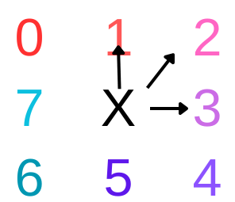

# LabirintoRecorrente: Implementação em C++

 
 
</a> 

# Problema Proposto

  Utilizando o processo de caminhamento aleatorio, nesse projeto o objetivo é caminhar por matrizes NxN, passadas como entrada, iniciando pela posição digitada pelo usuario. O caminho passado será o que for gerado aleatoriamente, sendo possivel caminhar a direita, a esquerda, baixo, cima, diagonais para esquerda e direita para baixo e para cima, apresentando tambem a possibilidade de andar entre as matrizes. 
  Através dessas regras, o objetivo do programa apresentado e consumir o maximo de itens possiveis ate chegar a zerar as possibilidades ou morrer tentando. Os valores que sao iguais a # sao paredes, estas impossibilitam o garoto a andar naquela posicao da matriz, ja os que sao iguais a * retiram vida do garoto, e os valores numericos sao itens, que ao serem consumidos em certa quantidade aumentam em 1 a vida do garoto. O garoto inicia o algoritmo com 10 de vida, e ao chegar em 0 o garoto perde.

# Lógica
A funcao `read()` e a principal do projeto, sendo a unica a ser chamada no main, ela possibilita a leitura de todas as matrizes do arquivo a serem utilizadas no restante do programa. Durante o processo de leitura que esta no arquivo `ler.cpp` que esta na pasta `src` que esta nas linhas 24 a 74 ocorre o processo de tokenizacao das informacoes que estao no arquivo, primeiro pegando o tamanho das matrizes e depois a quantidade de matrizes que estao no arquivo, depois ocorre a passagem de string para int juntamente com a transformacao da #-> -1 e *->- 2, para que seja possivel fazer as operacoes no resto do programa. A funcao `criarMap()` e chamada apos a finalizacao da leitura da primeira matriz, essa funcao e responsavel por dividir as matriz em arquivos diferentes pegando a matriz atual que esta sendo lida e colocando no arquivo criado apartir de concatenacoes, ela e tambem responsavel por alterar as matrizes ao decorrer do programa, vale ressaltar que, durante o processo de separacao das matrizes para seus respectivos arquivos, no final de cada matriz e adicionado um ponto na ultima linha, esse ponto e responsavel por tornar possivel a leitura da ultima linha da matriz.  
Ao finalizar este processo, a funcao `readOneMap()` e chamada, nela o usuario digita a posicao inicial da qual ira comecar a andar no primeiro mapa. Para andar em todas as matrizes foi criado um processo iterativo, ele e executado enquanto um contador e menor que o numero de matrizes que estavam no arquivo, esta funcao realiza a leitura do arquivo referente ao contador atual, comecando, por exemplo, na `input0.data`, durante o processo de leitura ocorre a tokenizacao das informacoes que estao no arquivo, e transformar de string para int, ao acabar esse processo, a funcao `movimento()` e chamada, esta funcao e responsavel por movimentar o garoto pela matriz enquanto a vida atual for diferente de zero e o contador de zeros for diferente da soma do tamanho de todas as matrizes, dentro desta e valido ressaltar duas funcoes, a funcao `configDeCaminho()` que e responsavel por gerar o numero aleatorio de 0 a 7 que ira determinar na funcao `selecionandoCaminho()` o caminho a ser tomado pelo garoto, evitando sempre as posicoes de valor -1.  
  
  

As posicoes na imagem acima mostra respectivamente os valores usando para fazer o switch case, que determina o caminho a ser tomado pelo garoto na funcao `selecionandoCaminho()`. 
Dentro da funcao `configDeCaminho()`, foi configurado as acoes permitidas em determinadas posicoes, apartir destas e possivel caminhar na matriz evitando posicoes indesejadas e passar de uma matriz para outra. Exemplos:
1- Linha e coluna atual igual a 0. A imagem abaixo apresenta as unicas possibilidades de movimento. 
   
  

2- Linha igual ao tamanho da matriz e coluna igual a 0. A imagem abaixo apresenta as unicas possibilidades de movimento. 
   
  

3- Coluna igual ao tamanho da matriz. A imagem abaixo apresenta a possibilidade de movimentar de uma matriz para outra, sendo valido ressaltar que nessa possibilidade em especifico o aleatorio gera o numero de valor 10, quando essa numero retorna a funcao `movimento()` a funcao `criarMap()` e chamada, alterando a matriz atual apartir do movimentos que foram feitos, e em seguida retornando a funcao `readOneMap()` para que a proxima matriz seja chamada. 
  
  

4- Linha igual ao tamanho da matriz. A imagem abaixo apresenta as unicas possibilidades de movimento. 
   
  

5- Coluna igual a 0. A imagem abaixo apresenta as unicas possibilidades de movimento. 
   
  

6- Linha igual a 0. A imagem abaixo apresenta as unicas possibilidades de movimento. 
   
  

Na funcao `movimento()` tambem sao tratadas codicoes importantes, que sao elas:  
-Enquanto o valor da posicao for igual a -1, ao passar de um mapa para outro, sera gerada novas posicoes aleatorias para [x,y] para que o garoto nao caia em uma posicao -1, na qual n e possivel movimentar. 
-Caso o valor da posicao atual for maior que zero, o garoto recebe um ponto para adicionar vida, quando ele receber 4 destes pontos, ele ganha +1 de vida, devido a isso, em seguida e chamada a funcao `altVida()` essa e responsavel para aumentar a vida, e zerar novamente os pontos para adicionar vida quando chega em 4. E retirado 1 do valor da posicao atual, e adicionado aos itens consumidos pelo garoto 1.   Caso a condicao acima explicada nao for realizada, ocorre a verificacao se o valor da posicao atual e menor ou igual a -2, caso seja e retirado um do valor da vida, e retirado 1 do valor da posicao atual, e adicionado um ao contador de perigos. 
Depois de realizar todos estes passos a funcao `movimento()` esta finalizada, e o garoto andou pela matriz atual, e caso nao tenha morrido mudou para a proxima matriz em algum momento. 
Para que esse processor nao continue infinitamente caso o garoto nao morra, uma variabel denominada `contZeros` foi criada no arquivo `map.cpp`, essa variavel juntamente com a variavel `soma` no arquivo `ler.cpp`, sao responsaveis por parar o garoto. A `soma` tem guardada a soma da quantidade de posicoes de todas as matrizes juntas. O `contZeros` recebe +1 se o valor da posica atual da matriz na funcao `movimento()` for igual a zero, e recebe zero toda vez que acha um valor maior que zero na posicao da matriz.
Voltando a funcao `readOneMap()`, se a `contZeros` for diferente de `soma` o algoritmo possibilita a mudanca de matrizes, se forem iguais o algoritmo e encerrado e retorna os valores de casas percorridas, itens consumidos e perigos enfrentados. 

  

Apos isso o programa retorna ao `ler.cpp` e chama a funcao `casasInexploradas()`, essa e responsavel por verificar as casas inexploradas depois que o garoto ja terminou de andar, ela le o arquivo `input.data` e quando termina a leitura da matriz atual, salvando a matriz, chama a funcao `lerComparacao()`, essa funcao e responsavel em abrir os arquivos `inputX.data` onde X e o valor recebido pelo contador na iteracao atual, le a matriz do arquivo e a salva. Apos ter as duas matrizes salvas ocorre a verificacao das suas posicoes, quando apresentam valor igual em posicoes iguais, o contador de casas inexploradas recebe +1. Apos finalizar esse processo para todas as matrizes, retorna a quantied de casas inexploradas. 

   
   
Para o caso em que o arquivo de entrada tivesse apenas um '\n' ao final, a leitura do arquivo considerava essa última linha já como o final do arquivo, o que interrompia o loop de leitura e não permitia que a última matriz fosse percorrida(não entrava no else). Para resolver este problema, foi criado um booleano `decisao` que é responsável por tomar a decisão se a última matriz salva já foi percorrida ou não. Este booleano é iniciado com false, e recebe falso toda vez que uma linha é tokenizada. O true só é atribuído à variável no else, que é onde as matrizes são percorridas. 
Então, por meio de um if após o loop de leitura, no caso onde o input do programa tivesse dois '\n', a variável booleana iria impedir a matriz de ser caminhada duas vezes, e no caso de apenas um '/n', ela seria percorrida dentro do if, finalizando o percorrimento de todas as matrizes corretamente. 

 # Resultados 
   Considerando a lógica e a descrição do problema acima, os resultados esperados durante a leitura do arquivo com 4 matrizes 6x6:  
   
   
 > OBS: O resultado apresentado é de apenas uma matriz 6x6.
   Todas as matrizes apresentaram o mesmo padrão de resultado, ao finalizar os processos, irá retornar as casas percorridas, a soma dos itens consumidos, a soma da quantidade de perigos enfrentados e as casas inexploradas. 
   
 # Conclusao
 
 # Bibliotecas 

Para o funcionamento do programa, é necessário incluir as seguintes bibliotecas: 
<ul>
    <li><code>#include 'iostream'</code></li>
    <li><code>#include 'fstream'</code></li>
    <li><code>#include 'vector'</code></li>
    <li><code>#include 'string'</code></li>
    <li><code>#include 'sstream'</code></li>
    <li><code>#include 'iterator'</code></li>
    <li><code>#include 'algorithm'</code></li>
    <li><code>#include 'time.h'</code></li>
</ul>

# Compilação e Execução

Esse pequeno exemplo possui um arquivo Makefile que realiza todo o procedimento de compilação e execução. Para tanto, temos as seguintes diretrizes de execução:

| Comando                |  Função                                                                                           |                     
| -----------------------| ------------------------------------------------------------------------------------------------- |
|  `make clean`          | Apaga a última compilação realizada contida na pasta build                                        |
|  `make`                | Executa a compilação do programa utilizando o g++, e o resultado vai para a pasta build           |
|  `make run`            | Executa o programa da pasta build após a realização da compilação                                 |

# Contatos

 

